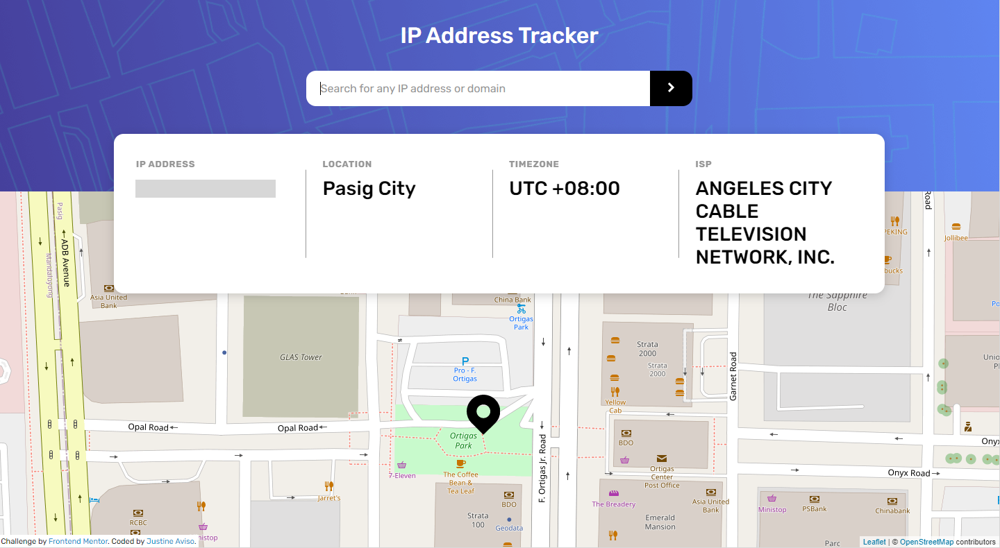

# Frontend Mentor - IP address tracker solution

This is a solution to the [IP address tracker challenge on Frontend Mentor](https://www.frontendmentor.io/challenges/ip-address-tracker-I8-0yYAH0). Frontend Mentor challenges help you improve your coding skills by building realistic projects. 

## Table of contents

- [Overview](#overview)
  - [The challenge](#the-challenge)
  - [Screenshot](#screenshot)
  - [Links](#links)
- [My process](#my-process)
  - [Built with](#built-with)
  - [What I learned](#what-i-learned)
  - [Continued development](#continued-development)
  - [Useful resources](#useful-resources)
- [Author](#author)

## Overview

### The challenge

Users should be able to:

- View the optimal layout for each page depending on their device's screen size
- See hover states for all interactive elements on the page
- See their own IP address on the map on the initial page load
- Search for any IP addresses or domains and see the key information and location

### Screenshot

Add a screenshot of your solution. The easiest way to do this is to use Firefox to view your project, right-click the page and select "Take a Screenshot". You can choose either a full-height screenshot or a cropped one based on how long the page is. If it's very long, it might be best to crop it.

Alternatively, you can use a tool like [FireShot](https://getfireshot.com/) to take the screenshot. FireShot has a free option, so you don't need to purchase it. 

Then crop/optimize/edit your image however you like, add it to your project, and update the file path in the image above.

**Note: Delete this note and the paragraphs above when you add your screenshot. If you prefer not to add a screenshot, feel free to remove this entire section.**

### Links

- Solution URL: [My Solution](https://your-solution-url.com)
- Live Site URL: [Live website](https://your-live-site-url.com)

## My process

### Built with

- Flexbox
- Mobile-first workflow
- Fetch API
- Composition API
- [Vue3](https://v3.vuejs.org/) - JS library
- [Leaflet Vue](https://github.com/vue-leaflet/vue-leaflet) - For Map Component

### What I learned

I've learn to plan everything, such as font sizes, colors, element's width and what library to use before coding. It helps me to have a better workflow. And specially dealing with api response and managing it.

I've also learned that you could combine calc and minmax to have a more flexible units

### Continued development

There are areas in this project that I struggle, just like on managing response from an api and letting the components and scripts to wait before it renders on the users screens. I also want to focus on having a better workflow, especially when implementing design, because I think I spend too much time looking on minor changes whenever i am styling elements through css.
*I also want to improve on having a better reading comprehention, because whenever i read documentation. I sometimes find it hard to retain informations

### Useful resources

- [Example resource 1](https://leafletjs.com/) - I didn't have experience on using this library, it helps me understand its concepts trough its documentation and different examples.
- [Example resource 2](https://vue2-leaflet.netlify.app/components/) - Has some great documentation that helps me understand how to use leaflet in Vue.

**Note: Delete this note and replace the list above with resources that helped you during the challenge. These could come in handy for anyone viewing your solution or for yourself when you look back on this project in the future.**

## Author

- Frontend Mentor - [@justineaviso](https://www.frontendmentor.io/profile/eta1389)
- Facebook - [Justine Aviso](https://www.facebook.com/aviso.jstn)

**Note: Delete this note and add/remove/edit lines above based on what links you'd like to share.**

